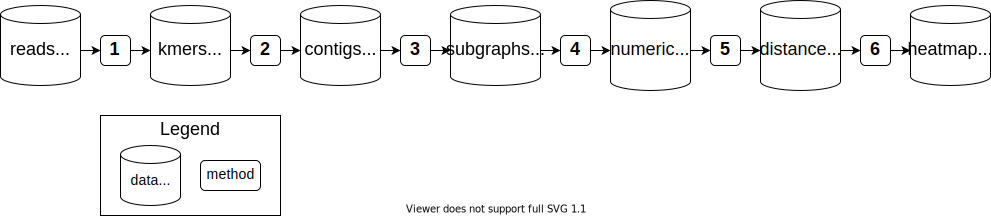
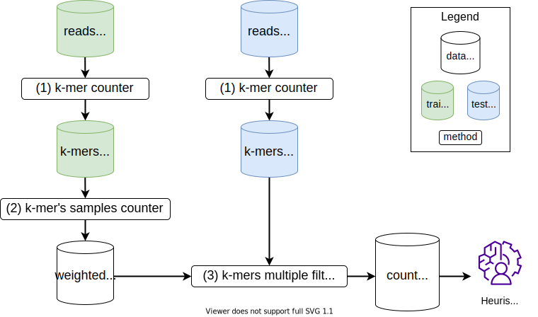

# MetaFast pipelines
Here three possible usage pipelines of MetaFast toolkit are presented. Each pipeline can be run via one command with all input arguments or step by step for better control of the intermediate outputs. Also several tools for converting files from internal binary format to common fasta or tab-separated files are described.

## Content

* [Pipeline 1. Metagenomic distance estimation](#pipeline-1-metagenomic-distance-estimation)
* [Pipeline 2. Unique metagenomic features finder](#pipeline-2-unique-metagenomic-features-finder)
* [Pipeline 3. Specific metagenomic features counter](#pipeline-3-specific-metagenomic-features-counter)
* [Format conversion tools](#format-conversion-tools)

## Pipeline 1. Metagenomic distance estimation

Original MetaFast pipeline. Compares several metagenomic samples by building the distance matrix between them and creating a heatmap.

`
java -jar metafast.jar -t matrix-builder -k <k> -i <inputFiles>
`

After the pipeline has finished, a distance matrix can be found in `workDir/matrices/dist_matrix_<date>_<time>_original_order.txt` and heatmap in `workDir/matrices/dist_matrix_<date>_<time>_heatmap.png`.

Step-by-step data processing is presented on the image above. Order of tools to run:

1. **K-mers counter**  
Extract k-mers from each metagenomic sample and saves in internal binary format for further processing (`workDir/kmer-counter-many/kmers/*.kmers.bin`)  
`
java -jar metafast.jar -t kmer-counter-many -k <k> -i <inputFiles>
`
2. **Sequence builder**  
Builds de Bruijn graph for each set of input k-mers independently and extracts linear contigs (`workDir/seq-builder-many/sequences/*.seq.fasta`)  
`
java -jar metafast.jar -t seq-builder-many -k <k> -i <*.kmers.bin> -l <minimal sequence length>
`
3. **Component cutter**  
Builds single de Bruijn graph for all sequences and splits it into connected subgraphs of specified size (`workDir/component-cutter/components.bin`)  
`
java -jar metafast.jar -t component-cutter -k <k> -i <sequncesFiles> -b1 <minimal component size>  -b2 <maximal component size>
`
4. **Features calculator**  
Counts coverage of each component (subgraph) by k-mers for each metagenomic sample independently. For each sample outputs numerical features vector of coverages  (`workDir/features-calculator/vectors/*.vec`)  
`
java -jar metafast.jar -t features-calculator -k <k> -cm <components.bin> -ka <*.kmers.bin>
`
5. **Distance matrix calculator**  
Calculates distance matrix between samples based on features vectors using Bray-Curtis metric (`workDir/matrices/dist_matrix_<date>_<time>_original_order.txt`)  
`
java -jar metafast.jar -t dist-matrix-calculator --features <*.vec>
`
6. **Heatmap maker**  
Produces heatmap and dendrogram based on distance matrix between metagenomic samples (`workDir/matrices/dist_matrix_<date>_<time>_heatmap.png`)  
`
java -jar metafast.jar -t heatmap-maker -i <dist_matrix_<date>_<time>_original_order.txt>
`

## Pipeline 2. Unique metagenomic features finder

Pipeline for extracting **unique** features from groups of metagenomic samples and manipulating with them. Also, supports features construction for samples with unknown category for further category prediction.

`
java -jar metafast.jar -t unique-features -k <k> -pos <postiveFiles> -neg <negativeFiles> --min-samples <int> --max-samples <int> -b <int> [--split]
`

`k` – k-mer size

`pos` – list of reads files from positive group

`neg` – list of reads files from negative group

`min-samples` – minimal number of samples k-mer to be present in

`max-samples` – maximal number of samples k-mer to be present in

`b` – maximal frequency for a k-mer to be assumed erroneous

`split` – saves each component in separate file

**Output files in _workDir_:**

`kmer-counter-posneg\pos\kmers\*.kmers.bin` – k-mers from input files from **positive** group in binary format

`kmer-counter-posneg\neg\kmers\*.kmers.bin` – k-mers from input files from **negative** group in binary format

`unique-kmers-multi\kmers\filtered.kmers.bin` – unique k-mers in binary format

`kmers-filter\kmers\*.kmers.bin` – intersection of input k-mers and unique k-mers

`component-extractor\components.bin` – components built around unique k-mers in binary format

`comp2seq\kmers-counter-many\kmers\component_*.kmers.bin` – k-mers from components in binary format

`comp2seq\kmers_fasta\component_*.fasta` – k-mers from components in fasta format

`comp2seq\seq-builder-many\sequences\component_*.seq.fasta` – contigs from components in fasta format

`features-calculator\vectors\*` – feature vectors of components' coverage by input files

Step-by-step data processing is presented on the image above. Order of tools to run:

1. **K-mers counter**  
Extract k-mers from each metagenomic sample and saves in internal binary format for further processing (`workDir/kmers/*.kmers.bin`). This step can be performed separately for metagenomes with known and unknown categories. For the convenience of further explanations we will refer to samples with known categories as _group\_1.kmers.bin_ ... _group\_N.kmers.bin_ for N categories and _ungroupped.kmers.bin_ for samples with unknown category.   
`
java -jar metafast.jar -t kmer-counter-many -k <k> -i <inputFiles>
`
2. **Unique k-mers finder**  
Extract k-mers present in at least given number G of samples of one category and absent in all samples of other categories (`workDir/kmers/filtered_G.kmers.bin`). By default G=1 and can be user-defined to iterate in range [--min-samples; --max-samples].  
`
java -jar metafast.jar -t unique-kmers-multi -k <k> -i <group_1.kmers.bin> --filter-kmers <group_{2..N}.kmers.bin> --min-samples <int> --max-samples <int>
` will extract unique k-mers for category 1.
3. **K-mers filter**  
Extract k-mers from input metagenomes that are present in specified set of k-mers. It can be used to select unique k-mers for each category from sample with unknown category and classify metagenome based on number of k-mers of each category. (`workDir/kmers/*.kmers.bin`)  
`
java -jar metafast.jar -t kmers-filter -k <k> -i <ungroupped.kmers.bin> --filter-kmers <filtered_1.kmers.bin>
`
4. **Component extractor**  
Extract local environment in the de Bruijn graph around specified k-mers. These subgraph components can be used as features specific for analyzed category  (`workDir/components.bin`)  
`
java -jar metafast.jar -t component-extractor -k <k> -i <group_1.kmers.bin> --pivot <filtered_1.kmers.bin>
`
5. **Features calculator**  
Counts coverage of each component (subgraph) by k-mers for each metagenomic sample independently. For each sample outputs numerical features vector of coverages  (`workDir/vectors/*.vec`). Features vectors for samples with known categories can be further used to train machine learning model to predict categories for samples with unknown categories.  
`
java -jar metafast.jar -t features-calculator -k <k> -cm <components.bin> -ka <*.kmers.bin>
`
6. **Sequence extractor**  

Split specific subgraph components into linear genomic sequences, that can be used for analysis with external tools. It can be run via a single command:  
`
java -jar metafast.jar -t comp2seq -k <k> -cf <components.bin> [--split]
`  
`Split` flag determines, whether to save sequences from all components into separate files. Resulting sequences can be found in `workDir/seq-builder-many/sequences/*.seq.fasta`. Alternatively, the following steps result in the same sequences:

   1. Transform subgraphs from binary format to fasta  
`
java -jar metafast.jar -t bin2fasta -k <k> -cf <components.bin> -o <components.fasta>
`
   1. Extract linear sequences from subgraphs' k-mers  
`
java -jar metafast.jar -f seq-builder-many -k <k> -i <components.fasta>
`

## Pipeline 3. Specific metagenomic features counter

Pipeline for extracting **specific** features from groups of metagenomic samples and manipulating with them. Also supports features construction for samples with unknown category for further category prediction.

TODO: Create class for running pipeline in one command

Step-by-step data processing is presented on the image above. Order of tools to run:

1. **K-mers counter**  
Extract k-mers from each metagenomic sample and saves in internal binary format for further processing (`workDir/kmer-counter-many/kmers/*.kmers.bin`). This step can be performed separately for metagenomes with known and unknown categories. For the convenience of further explanations we will refer to samples with known categories as _group\_1.kmers.bin_ ... _group\_N.kmers.bin_ for N categories and _ungroupped.kmers.bin_ for samples with unknown category.   
`
java -jar metafast.jar -t kmer-counter-many -k <k> -i <inputFiles>
`
2. **K-mers' samples counter**  
Count number of samples containing k-mers from group G of metagenomic samples. For each k-mer saves the number of samples as a weight (`workDir/group_G/n_samples.kmers.bin`). These weights can be counted for different categories and further used to identify k-mers specific (i.e. prevalent) for a certain category.  
`
java -jar metafast.jar -t kmers-samples-counter -k <k> -i <group_1.kmers.bin> -o <group_G>
` will count for each k-mer in category 1 the number of samples it is found in.
3. **K-mers multiple filters**  
This tool is designed to be used with 3 categories of metagenomes and provide the staistics for unclassified metagenomes. In original research, it was applied for metagenomic datasets of patients with [Inflammatory Bowel Disease (IBD)](https://en.wikipedia.org/wiki/Inflammatory_bowel_disease). Three categories are patients with Crohn's disease, ulcerative colitis and healthy subjects. For each metagenomic sample with unknown category k-mers are compared to three sets of weighted k-mers. Output is a tab-separated file containing information about number of k-mers with various abundances among samples in three categories. (`workDir/stats/*.stat.txt`)  
`
java -jar metafast.jar -t kmers-multiple-filters -k <k> -i <ungroupped.kmers.bin> -cd <workDir/group_1/n_samples.kmers.bin> -uc <workDir/group_2/n_samples.kmers.bin> -nonibd <workDir/group_3/n_samples.kmers.bin>
`

## Format conversion tools

#### Binary to Fasta convertor

Tool accepts k-mers or components in internal MetaFast binary format and outputs them in fasta format. Components are printed as a set of k-mers and different components can be printed separately (`--split` option).

`
java -jar metafast.jar -t bin2fasta -k <k> {-kf <binary k-mers> | -cf <binary components>} [--split]
`

#### Binary to tab-separated convertor

Tool accepts k-mers or components in internal MetaFast binary format and outputs them in tab-separated format. First column contains k-mers and second column contains their respective number of occurences.

`
java -jar metafast.jar -t view -k <k> {-kf <binary k-mers> | -cf <binary components>}
`

#### Sequence to components convertor

Tool accepts genomic sequences in fasta format and converts them to components, so that they can be used for features calculations.

`
java -jar metafast.jar -t seq2comp -k <k> -i <sequencesFile>
`