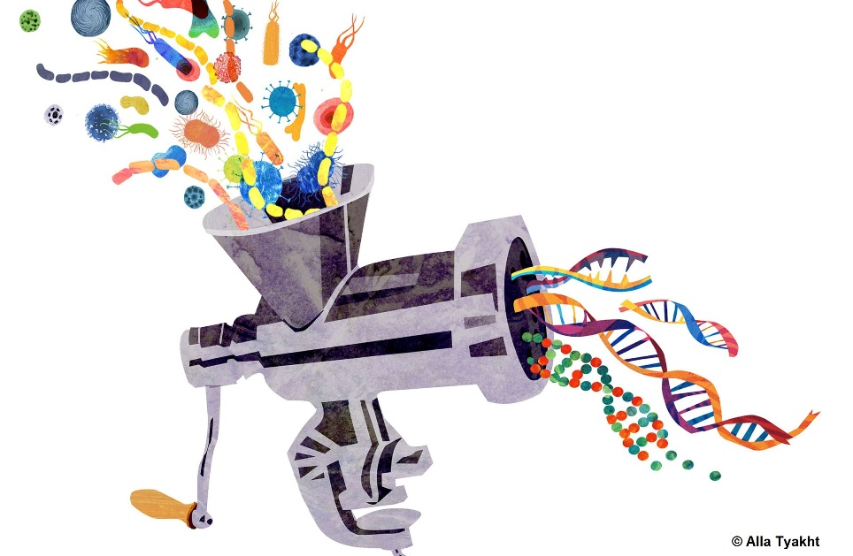

# MetaFast

**MetaFast** (METAgenome FAST analysis toolkit) is a toolkit for calculating a number of statistics of 
metagenome sequences and building the distance matrix between them.

Authors:
* **Software:** *Sergey Kazakov* and *Vladimir Ulyantsev*,  
ITMO University, Saint-Petersburg, Russia.
* **Testing:** *Veronika Dubinkina* and *Alexandr Tyakht*,  
SRI of Physical-Chemical Medicine, Moscow, Russia.
* **Idea, supervisor:** *Dmitry Alexeev*,  
SRI of Physical-Chemical Medicine, Moscow, Russia.

**MetaFast** documentation is available on the GitHub [wiki page](https://github.com/ctlab/metafast/wiki). 
Here is a short version of it.

## Content

* [Installation](#installation)
* [Running instructions](#running-instructions)
* [Example](#example)
* [Citation](#citation)
* [Contact](#contact)
* [License](#license)
* [See also](#see-also)

## Installation

To run MetaFast you need to have JRE 1.6 or higher installed and only one script – `metafast.sh`, `metafast.bat` or `metafast.jar`.

You can download it from the last stable release in the GitHub ['Releases' section](https://github.com/ctlab/metafast/releases).

* For *Linux* and *Mac OS*: download `metafast.sh`, run the command `chmod a+x metafast.sh`, then run `./metafast.sh` from the command line.
* For *Windows*: download `metafast.bat` and run it from the command line.
* For other OS: download `metafast.jar` and run it via command `java -jar metafast.jar`.

Alternatively, you can build the newest version of the MetaFast from the repository:
~~~
git clone https://github.com/ctlab/metafast.git
cd metafast
ant
./out/metafast.sh --version
~~~

## Running instructions

To run MetaFast use the following syntax:
* `metafast.sh [<Launch options>] [<Input parameters>]`
* `metafast.bat [<Launch options>] [<Input parameters>]`
* `java -jar metafast.jar [<Launch options>] [<Input parameters>]`

To view help for launch options and input parameters run `metafast.sh --help` or `metafast.sh --help-all`.

By running MetaFast a working directory is created (by default `./workDir/`). 
All intermidiate files, log file and final results are saved in it. 

File `output_description.txt` is created after every run in the current and working directories. 
It contains the description of every output file produced by the MetaFast.

Metafast run script also allows you to run subtools of whole process or different tools, that was included into the package. 
To see the list of available additional tools, run `metafast.sh --tools`.

## Example

Download [meta_test_1.fa](https://github.com/ctlab/metafast/raw/master/test_data/meta_test_1.fa),
[meta_test_2.fa](https://github.com/ctlab/metafast/raw/master/test_data/meta_test_2.fa) and 
[meta_test_3.fa](https://github.com/ctlab/metafast/raw/master/test_data/meta_test_3.fa) and run the command:
~~~
./metafast.sh -i meta_test_1.fa meta_test_2.fa meta_test_3.fa
~~~

After it has finished, a distance matrix can be found in `workDir/matrices/dist_matrix_<date>_<time>_original_order.txt`:
~~~
#       meta_test_1     meta_test_2     meta_test_3
meta_test_1     0.0000  0.5691  0.2981
meta_test_2     0.5691  0.0000  0.8448
meta_test_3     0.2981  0.8448  0.0000
~~~

The element `matrix[i][j]` is a distance between *sample i* and *sample j*.

K-mers frequency statistics is saved in `workDir/kmer-counter-many/stats/<in-file>.stat.txt`; 
image file with heatmap and dendrogram is saved in `workDir/matrices/dist_matrix_<date>_<time>_heatmap.png`: 

## Citation

If you use MetaFast in your research, please cite the following publication:

Ulyantsev V.I., Kazakov S.V., Dubinkina V.B., Tyakht A.V. & Alexeev D.G. (2016). 
MetaFast: fast reference-free graph-based comparison of shotgun metagenomic data. 
Bioinformatics, btw312. 
[doi: 10.1093/bioinformatics/btw312](http://bioinformatics.oxfordjournals.org/content/early/2016/06/16/bioinformatics.btw312)

## Contact

Please report any problems directly to the GitHub [issue tracker](https://github.com/ctlab/metafast/issues). 
Also, you can send your feedback to [svkazakov@rain.ifmo.ru](mailto:svkazakov@rain.ifmo.ru).

## License

The MIT License (MIT)

## See also

* [khmer](https://github.com/ged-lab/khmer) – a toolkit to split reads.
* [crAss](http://edwards.sdsu.edu/crass/) – Cross-Assembly of Metagenomes.
* [MaryGold](http://sourceforge.net/projects/metavar/) – Variation analysis of metagenomic samples.

